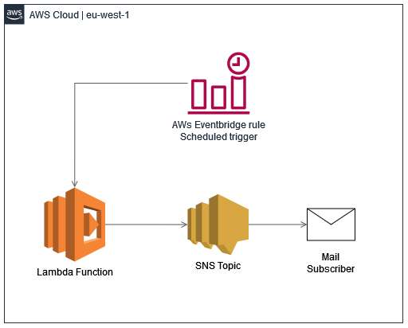
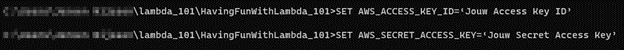
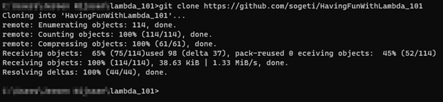
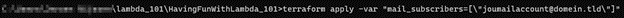

# Having fun with Lambda - 101

## Status

Lambda is een van de tweehonderd cloud services van AWS. Lambda is een serverless compute service. Deze dienst biedt de mogelijkheid om code te draaien zonder dat je hoeft na te denken over de onderliggende compute. Lambda is vanuit zijn dienst hoog beschikbaar. De dienst zorgt zelf voor de automatische schaling, capaciteit provisioning en de noodzakelijke runtimes. Daarnaast wordt de code automatisch gemonitord en gelogd. Daarom is het niet nodig om te investeren in platformkennis en kan het team zich focussen op andere werkzaamheden.
Bij Sogeti wordt Lambda toegepast in ons volledige spectrum van applicatie en services. We gebruiken het bijvoorbeeld bij Sligro om geautomatiseerd het storage cluster te schalen (FSX). We gebruiken het bij PostNL om failovers te doen binnen gebouw beveiliging oplossing.

Voor verder details over, van, voor AWS Lambda, adviseer ik je om te kijken op: [amazon.com](https://aws.amazon.com/lambda/)

# Lambda 101 - Buienradar weersverwachting

Nu we een beeld hebben wat een AWS Lambda is, kunnen we deze lambda ook binnen een omgeving plaatsen. Voor de 101 gaan we een lambda maken welke met een bepaalde regelmaat je de weersverwachting van morgen stuurt.

Dit doen we aan de hand van de volgende architectuur

## Services

We beginnen aan de hand van de architectuur zoals hierboven op de afbeelding. In het voorbeeld is te zien dat er drie AWS Services in worden gebruikt. Namelijk Lambda, SNS en Cloudwatch.

- AWS Lambda

    Voor het verwerken van de code, code is terug te vinden in [buienradar-lambda.py](./buienradar/buienradar-lambda.py)

- AWS SNS

    Voor het versturen van de mail, hiervoor zetten we later nog een variable op.

- AWS Cloudwatch

    voor het aanroepen van de code.

## Ontwikkelomgeving

Om nu deze code echt te gaan deployen, zullen we eeste onze ontwikkelomgeving op moeten zetten.
Hiervoor hebben we een aantal tools nodig;

1. Terraform - [installatie instructies](https://learn.hashicorp.com/tutorials/terraform/install-cli), [executable](https://releases.hashicorp.com/terraform/1.2.2) (selecteer hier de juist voor jouw OS.)

2. Git - [installatie instructies](https://github.com/git-guides/install-git)

Naast de tools hebben we ook nog AWS-toegang nodig, dit zetten we op door gebruik te maken van de environment variabele van jouw besturingssysteem.

  

  Windows - CMD
  

    SET AWS_ACCESS_KEY_ID='Jouw Access Key ID'
    SET AWS_SECRET_ACCESS_KEY='Jouw Secret Access Key'

  

  MacOS \ Unix
  

    export AWS_ACCESS_KEY_ID='Jouw Access Key ID'
    export AWS_SECRET_ACCESS_KEY='Jow Secret Access Key'

## Uitvoeren

Nu we onze ontwikkelomgeving, en ook de benodigde AWS-toegang hebben. Kunnen we de volgende stap maken. En dat is dit geval de code vanuit GitHub downloaden. Dit kunnen we op verschillende manieren doen, het makkelijkste is door het uitvoeren van het volgende commando.

`git clone https://github.com/sogeti/HavingFunWithLambda_101.git`

Dit commando, zal de code welke op [GitHub](https://github.com/sogeti/HavingFunWithLambda_101) staat downloaden. En ons op die manier voorzien van de benodigde configuratie.

Nu hebben we alles om daar werkelijk de verschillende "resources" binnen ons AWS-account aan te maken. dit kunnen we doen door het volgende commando uit te voeren.

**_NOTE:_** Hou er rekening mee dat je de waarde van jouwmailaccount@domein.tld aanpast naar jouw eigen mail.

### MacOS \ Unix

    terraform apply -var 'mail_subscribers=["jouwmailaccount@domein.tld"]'

### Windows Command Prompt (do not use PowerShell on Windows)

    terraform apply -var "mail_subscribers=[\"jouwmailaccount@domein.tld\"]"

Nu hebben we de omgeving neergezet zoals hij in het design staat beschreven en krijgen we iedere dag de weersverwachting van morgen binnen.

## Terraform Details

Alle terraform details zijn terug te vinden in de [tf-documentation](tf-documentation.md)

## Cost Estimation

Kosten zijn altijd een belangrijk aspect binnen een cloud omgeving, vandaar dat er een kosten raming gemaakt is, zie [tf-cost](tf-cost.md)

**_NOTE:_** Binnen de kosten raming houden we rekening met een geschat (normaal) verbruik. aangezien het gebruik/verbruik van iedereen kan verschillen.
