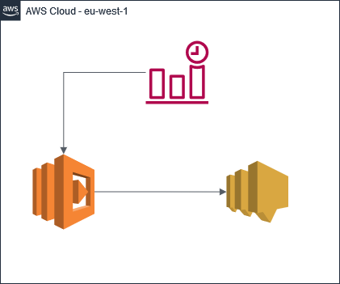

# Having fun with Lambda - 101

AWS Lambda, is een serverless compute service van AWS. Deze dienst geeft jou de mogelijkheid om code te draaien zonder je zorgen te maken over de onderliggende compute. Lambda is vanuit zijn dienst hoog beschikbaar. De dienst zorgt zelf voor de automatische schaling, capaciteit provisioning en de noodzakelijke runtimes.

Voor verder details over, van, voor AWS Lambda, adviseer ik je om te kijken op: [amazon.com](https://aws.amazon.com/lambda/)

Nu we een beeld hebben wat een AWS Lambda is, kunnen we deze lambda ook binnen een omgeving plaatsen. Voor de 101 gaan we een lambda maken welke met een bepaalde regelmaat je de weersverwachting van morgen stuurt.

dit doen we aan de hand van de volgende architectuur

## Services

Zoals we in de architectuur plaat kunnen zien hebben we een 3tal AWS Serivce in gebruik.

- AWS Lambda

    Voor het verwerken van de code, code is terug te vinden in [buienradar-lambda.py](./buienradar/buienradar-lambda.py)

- AWS SNS

    Voor het versturen van de mail, hiervoor zetten we later nog een variable op.

- AWS Cloudwatch

    voor het aanroepen van de code.

## Ontwikkelomgeving

Om nu deze code echt te gaan deployen, zullen we eeste onze ontwikkel omgeving op moeten zetten.
hiervoor hebben we een aantal tools nodig;

1. Terraform - [installatie instructies](https://learn.hashicorp.com/tutorials/terraform/install-cli), [executable](https://releases.hashicorp.com/terraform/1.2.2) (selecteer hier de juist voor jou OS.)

2. Git - [installatie instructies](https://github.com/git-guides/install-git)

Naast de tools hebben we ook nog AWS toegang nodig, dit zetten we op door geburik te maken van de environment variabele van jouw besturingsysteem.

  

  Windows - CMD
  

    SET AWS_ACCESS_KEY_ID='Jouw Access Key ID'
    SET AWS_SECRET_ACCESS_KEY='Jow Secret Access Key'

  

  MacOS \ Unix
  

    export AWS_ACCESS_KEY_ID='Jouw Access Key ID'
    export AWS_SECRET_ACCESS_KEY='Jow Secret Access Key'

## Uitvoeren

Nu we onze ontwikkelomgeving, alsmede de benodigde AWS toegang hebben. kunnen we de volgende stap maken. en dat is dit geval de code vanuit GitHub downloaden. dit kunnen we op verschillende manieren doen, het makkelijkste is door het uitvoeren van het volgende commando.

`git clone https://github.com/jeroen-nijssen/HavingFunWithLambda_101.git`

Dit commando, zal de code welke op [GitHub](https://github.com/jeroen-nijssen/HavingFunWithLambda_101) staat downloaden. En ons op die manier voorzien van de benodigde configuratie.

Nu hebben we alles om daar werkelijk de verschillende "resources" binnen ons AWS account aan te maken. dit kunnen we doen door het volgende commando uit te voeren.

**_NOTE:_** Hou er rekening mee dat je de waarde van joumailaccount@domein.tld aanpast naar jou eigen mail.

**Unix-style shell**

    terraform apply -var 'mail_subscribers=["joumailaccount@domein.tld"]'

**Windows Command Prompt (do not use PowerShell on Windows)**

    terraform apply -var "mail_subscribers=[\"joumailaccount@domein.tld\"]"

Nu hebben we de omgeving neergezet zoals hij in het design staat beschreven en krijgen we iedere dag de weersverwachting van morgen binnen.

## Terraform Details

Alle terraform details zijn terug te vinden in de [tf-documentation](tf-documentation.md)
